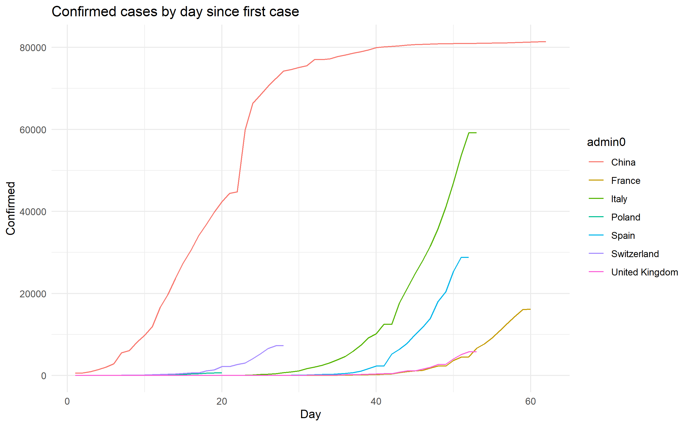

# cov

## To dos

* switch data source to ECDC or JHU?
* compute and chart moving window weekly case increase averages
* add deaths and recovered cases, compute active cases
* labels

  * explicitly add x-label for the most recent date
  * title, description, data source, etc
  * do something about verical grids and x-labels, show weeks more clearly
   
* add key events and a visual link to possible case rate-of-change change
* add shiny interface

  * selector for countries
  * selector for linear and log y-scales
  * selector for x-axis metric - date vs "days since first case"
  * add a "timeshift" tool so you can move one country to compare how many days behind another country it is

 ### Done
 
 * add a "days since first case" metric as an alternative x-axis to actual date
