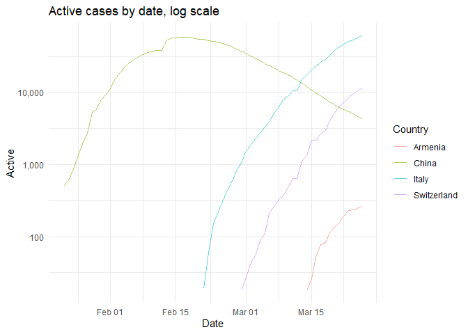
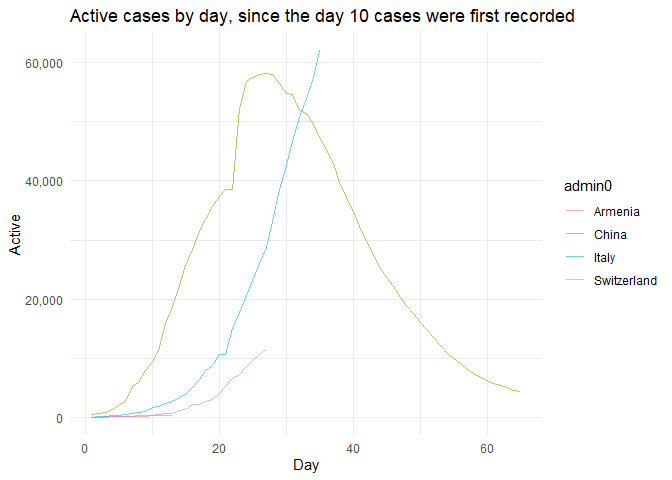
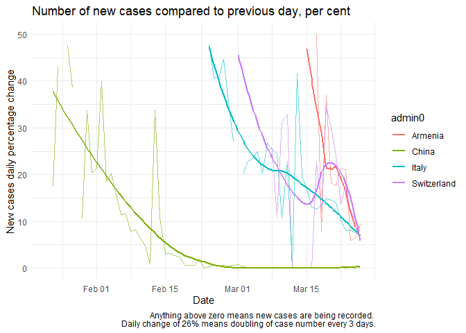

some covid-19 charts
================

``` r
Confirmed <- read_csv("https://raw.githubusercontent.com/CSSEGISandData/COVID-19/master/csse_covid_19_data/csse_covid_19_time_series/time_series_covid19_confirmed_global.csv")
Deaths <- read_csv("https://raw.githubusercontent.com/CSSEGISandData/COVID-19/master/csse_covid_19_data/csse_covid_19_time_series/time_series_covid19_deaths_global.csv")
Recovered <- read_csv("https://raw.githubusercontent.com/CSSEGISandData/COVID-19/master/csse_covid_19_data/csse_covid_19_time_series/time_series_covid19_recovered_global.csv")
isoalpha3 <- read_csv('https://gist.githubusercontent.com/tadast/8827699/raw/7255fdfbf292c592b75cf5f7a19c16ea59735f74/countries_codes_and_coordinates.csv')%>%
  select(Country, `Alpha-3 code`) %>%
  rename(iso_alpha3 = `Alpha-3 code`)

tidy_CSSE <- function(data, value_col = "Confirmed"){
  data%>%
    rename('admin1' = 'Province/State',
           'admin0' = 'Country/Region')%>%
    pivot_longer(cols = contains("/"), names_to = 'date_raw', values_to = value_col)%>%
    select(-Lat, -Long)%>%
    mutate(Date = as.Date(date_raw, format = "%m/%d/%y"))
}

tidy_CSSE_admin0 <- function(data, value_col = "Confirmed"){
  sum_col <- paste0(value_col)
  new_col <- paste0(enquo(value_col))[2]

  data %>%
    group_by(admin0, Date)%>%
    summarise(!!new_col := sum(!!sym(sum_col)))%>%
    left_join(isoalpha3, by = c('admin0' = 'Country'))%>%
    mutate(unique_id = paste0(iso_alpha3, Date))%>%
    ungroup()
  }


confirmed_tidy <- tidy_CSSE_admin0(tidy_CSSE(Confirmed, value_col = 'Confirmed'), value_col = 'Confirmed')
```

    ## Warning: Using `as.character()` on a quosure is deprecated as of rlang 0.3.0.
    ## Please use `as_label()` or `as_name()` instead.
    ## This warning is displayed once per session.

``` r
deaths_tidy <- tidy_CSSE_admin0(tidy_CSSE(Deaths, value_col = 'Deaths'), value_col = 'Deaths')
recovered_tidy <- tidy_CSSE_admin0(tidy_CSSE(Recovered, value_col = 'Recovered'), value_col = 'Recovered')
```

## parameters

threshold serves for making cleaner charts. The number of cases tends to
exhibit nice exponential behaviour from 10 cases upwards, setting it to
20 with some extra safety margin.

chart\_list defined which countries to chart. Duh.

``` r
threshold = 20
chart_list = c("Switzerland", "Italy", "China", "Poland")
```

``` r
all_data_admin0 <- left_join(confirmed_tidy,deaths_tidy, by = c('unique_id' = 'unique_id'))%>%
  left_join(recovered_tidy, by = c('unique_id' = 'unique_id'))%>%
  select(-contains("."))%>%
  select(admin0, iso_alpha3, Date, Confirmed, Deaths, Recovered) %>%
  group_by(admin0) %>%
  mutate(Active = (Confirmed - (Recovered + Deaths)),
         Day = row_number(dplyr::na_if(Confirmed, 0)),
         Mortality = Deaths/Confirmed,
         `New cases daily percentage change` = ifelse(Confirmed > threshold,
                                                      (Confirmed/lag(Confirmed)-1)*100, 
                                                      NA
         ),
         `Active cases daily percentage change` = ifelse(Active > threshold,
                                                      (Active/lag(Active)-1)*100, 
                                                      NA
         ),
         `Daily change of daily percentage change` = `Active cases daily percentage change` - lag(`Active cases daily percentage change`)
         ) 

all_data_admin0 %>%
  filter(admin0 %in% chart_list) %>%
  ggplot() + geom_line() + theme_minimal() ->
  covplot
```

``` r
covplot + aes(x=Date, y=Active, colour=admin0) +
  scale_y_log10(labels = scales::comma) + 
  labs(title = "Active cases by date, log scale", colour = "Country") 
```

    ## Warning: Transformation introduced infinite values in continuous y-axis

<!-- -->

``` r
covplot + aes(x=Date, y=Active, colour=admin0) +
  aes(x=Day, y=Active, colour=admin0) +
  scale_y_continuous(labels = scales::comma) + labs(title = "Active cases by day since first case")
```

    ## Warning: Removed 85 rows containing missing values (geom_path).

<!-- -->

``` r
covplot + 
  aes(x=Date, y=`New cases daily percentage change`, colour=admin0)+ geom_smooth(se=F) +
  labs(title = "Number of new cases compared to previous day, per cent", 
       caption = "Anything above zero means new cases are being recorded. 
       Daily change of 26% means doubling of case number every 3 days.")
```

    ## `geom_smooth()` using method = 'loess' and formula 'y ~ x'

    ## Warning: Removed 119 rows containing non-finite values (stat_smooth).

    ## Warning: Removed 119 rows containing missing values (geom_path).

<!-- -->

``` r
covplot + 
  aes(x=Date, y=`Daily change of daily percentage change`, colour=admin0) + 
  geom_smooth(se=F) +
  labs(title = "Change of speed of increase of active cases", 
     caption = "Positive values mean that active cases are increasing at an increasing rate. 
     Negative values mean that active cases are increasing at a decreasing rate. 
     Well, not really. The math is off for now.")
```

    ## `geom_smooth()` using method = 'loess' and formula 'y ~ x'

    ## Warning: Removed 123 rows containing non-finite values (stat_smooth).

    ## Warning: Removed 123 rows containing missing values (geom_path).

<!-- -->

## To do

  - switch data source to ECDC or JHU?

  - add country population, compute cases per capita

  - compute and chart moving window weekly (3-day?) case increase
    averages

  - labels
    
      - explicitly add x-label for the most recent date
      - title, description, data source, etc
      - do something about verical grids and x-labels, show weeks more
        clearly

  - add key events and a visual link to possible case rate-of-change
    change

  - add shiny interface
    
      - selector for countries
      - selector for linear and log y-scales
      - selector for x-axis metric - date vs “days since first case”
      - add a “timeshift” tool so you can move one country to compare
        how many days behind another country it is

#### Done

  - add a “days since first case” metric as an alternative x-axis to
    actual date
  - add deaths and recovered cases, compute active cases
