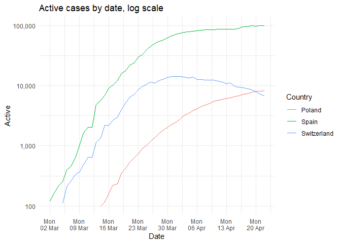
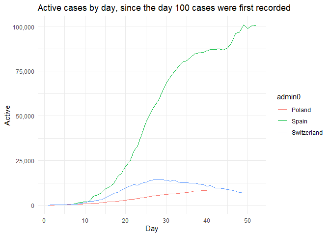
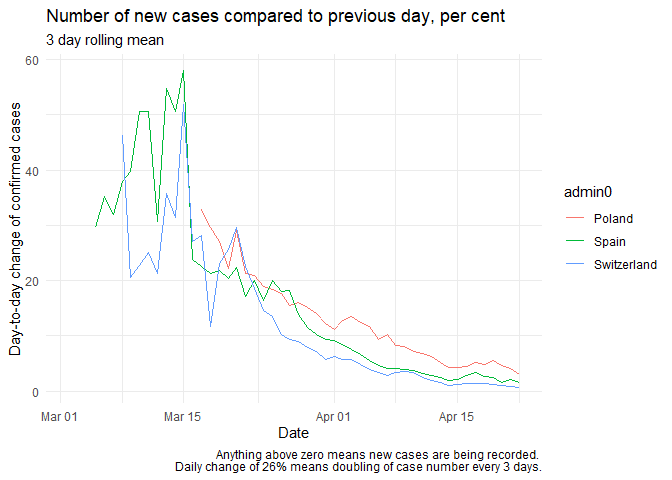
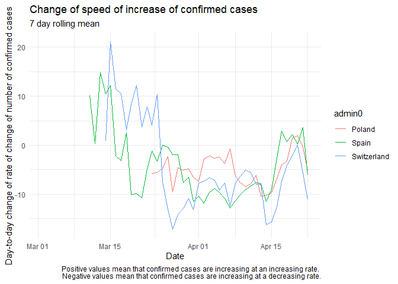
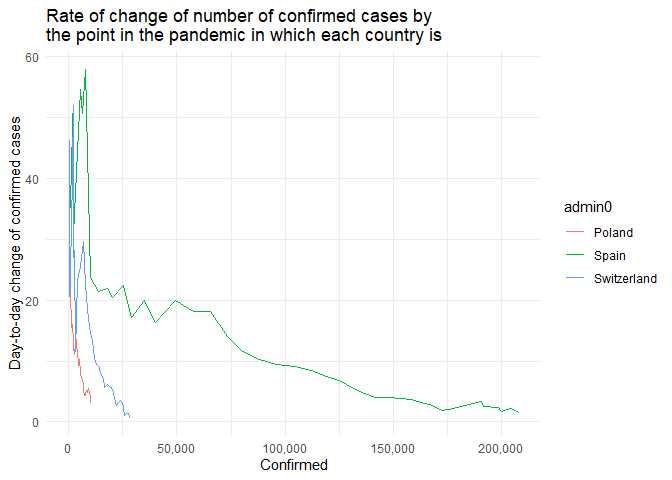

Some COVID-19 charts
================

## Parameters

All data points where confirmed cases are below the `threshold` are
discarded, which makes for cleaner charts. This is because the number of
cases tends to exhibit nice exponential behaviour from 10 or so cases
upwards. `places_to_chart` defines which countries to chart. Duh.

``` r
threshold = 10
places_to_chart = c("Switzerland", "Italy", "China", "Poland", "US")
```

## Load data

``` r
library(tidyverse)
library(zoo)
```

    ## Warning: package 'zoo' was built under R version 3.6.3

``` r
confirmed_raw <- read_csv("https://raw.githubusercontent.com/CSSEGISandData/COVID-19/master/csse_covid_19_data/csse_covid_19_time_series/time_series_covid19_confirmed_global.csv")
deaths_raw <- read_csv("https://raw.githubusercontent.com/CSSEGISandData/COVID-19/master/csse_covid_19_data/csse_covid_19_time_series/time_series_covid19_deaths_global.csv")
recovered_raw <- read_csv("https://raw.githubusercontent.com/CSSEGISandData/COVID-19/master/csse_covid_19_data/csse_covid_19_time_series/time_series_covid19_recovered_global.csv")

# isoalpha3 <- read_csv('https://gist.githubusercontent.com/tadast/8827699/raw/7255fdfbf292c592b75cf5f7a19c16ea59735f74/countries_codes_and_coordinates.csv') %>%
#   select(Country, `Alpha-3 code`) %>%
#   rename(iso_alpha3 = `Alpha-3 code`)

tidy_CSSE <- function(data, value_col){

    sum_col <- paste0(value_col)
    new_col <- paste0(enquo(value_col))[2]

    data %>%
    rename('admin1' = 'Province/State',
           'admin0' = 'Country/Region') %>%
    select(-Lat, -Long) %>%
    pivot_longer(cols = contains("/"), names_to = 'date_raw', values_to = value_col) %>%
    mutate(Date = as.Date(date_raw, format = "%m/%d/%y")) %>%
    group_by(admin0, Date) %>%
    summarise(!!new_col := sum(!!sym(sum_col))) %>%
    # left_join(isoalpha3, by = c('admin0' = 'Country')) %>%
    mutate(unique_id = paste0(admin0, Date)) %>%
    ungroup()
  }

confirmed_tidy <- tidy_CSSE(confirmed_raw, "Confirmed")
```

    ## Warning: Using `as.character()` on a quosure is deprecated as of rlang 0.3.0.
    ## Please use `as_label()` or `as_name()` instead.
    ## This warning is displayed once per session.

``` r
deaths_tidy <- tidy_CSSE(deaths_raw, "Deaths")
recovered_tidy <- tidy_CSSE(recovered_raw, "Recovered")
```

## Process

``` r
  left_join(confirmed_tidy,deaths_tidy, by = c('unique_id' = 'unique_id')) %>%
  left_join(recovered_tidy, by = c('unique_id' = 'unique_id')) %>%
  select(admin0 = admin0.x, Date=Date.x, Confirmed, Deaths, Recovered) %>%
  replace_na(list(Recovered = 0, Deaths = 0)) %>%
  group_by(admin0) %>%
  filter(Confirmed > threshold) %>%
  mutate(Active = Confirmed - (Recovered + Deaths),
         Day = row_number(1:n()),
         Mortality = Deaths/Confirmed*100,
         confirmed_delta = (Confirmed/lag(Confirmed)-1)*100,
         `Day-to-day change of confirmed cases` = rollmean(x = confirmed_delta, k = 3, align = "right", fill = NA),
         confirmed_delta_delta = (`Day-to-day change of confirmed cases`/lag(`Day-to-day change of confirmed cases`)-1)*100,
         `Day-to-day change of rate of change of number of confirmed cases` = rollmean(x = confirmed_delta_delta, k = 6, align = "right", fill = NA),
         # `Active cases daily percentage change` = (Active/lag(Active)-1)*100,
         # `Daily change of daily percentage change` = 
         #   `Active cases daily percentage change` - lag(`Active cases daily percentage change`)
         ) ->
  all_data_admin0
```

## Chart

``` r
all_data_admin0 %>%
  filter(admin0 %in% places_to_chart) %>%
  ggplot() + geom_line() + theme_minimal() ->
  covplot

covplot + aes(x=Date, y=Active, colour=admin0) +
  scale_y_log10(labels = scales::comma) + 
  labs(title = "Active cases by date, log scale", colour = "Country") 
```

<!-- -->

``` r
covplot + aes(x=Day, y=Active, colour=admin0) +
  scale_y_continuous(labels = scales::comma) + labs(title = paste("Active cases by day, since the day", threshold, "cases were first recorded"))
```

<!-- -->

``` r
covplot + 
  aes(x=Date, y=`Day-to-day change of confirmed cases`, colour=admin0)+ 
  # geom_smooth(se=F) +
  # ylim(0, 50) +
  labs(title = "Number of new cases compared to previous day, per cent", 
       subtitle = "3 day rolling mean",
       caption = "Anything above zero means new cases are being recorded. 
       Daily change of 26% means doubling of case number every 3 days.")
```

    ## Warning: Removed 15 rows containing missing values (geom_path).

<!-- -->

``` r
covplot + 
  aes(x=Date, y=`Day-to-day change of rate of change of number of confirmed cases`, colour=admin0) + 
  # geom_smooth(se=F) + 
  labs(title = "Change of speed of increase of active cases", 
       subtitle = "7 day rolling mean",
     caption = "Positive values mean that active cases are increasing at an increasing rate. 
     Negative values mean that active cases are increasing at a decreasing rate.")
```

    ## Warning: Removed 49 rows containing missing values (geom_path).

<!-- -->

``` r
covplot + 
  aes(x=Confirmed, y=`Day-to-day change of confirmed cases`, colour=admin0) +
  scale_x_continuous(labels = scales::comma) + 
  labs(title = "Rate of change of number of cases by\nthe point in the pandemic in which each country is", 
     caption = "This is the chart that really shows how truly screwed the US is.\nI'll add some explanation since it's not easy to read.")
```

    ## Warning: Removed 15 rows containing missing values (geom_path).

<!-- -->

## To do

  - switch data source to ECDC?

  - add country population, compute cases per capita

  - compute and chart moving window weekly (3-day?) averages, because
    these charts are a mess

  - labels
    
      - explicitly add x-label for the most recent date
      - title, description, data source, etc
      - do something about verical grids and x-labels, show weeks more
        clearly

  - add key events and a visual link to possible case rate-of-change
    change

  - add shiny interface
    
      - selector for countries
      - selector for linear and log y-scales
      - selector for x-axis metric - date vs “days since first case”
      - add a “timeshift” tool so you can move one country to compare
        how many days behind another country it is

#### Done

  - add a “days since first case” metric as an alternative x-axis to
    actual date
  - add deaths and recovered cases, compute active cases
